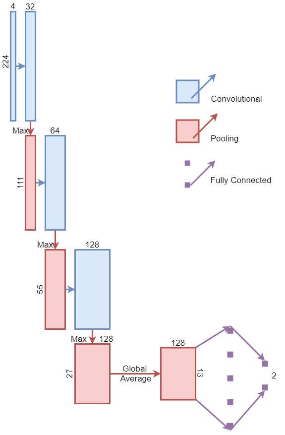

# Liquid Time-constant: An adoption of Recurrent Neurons to Convolutional Neural Network - Bachelor's Theis

## Progress Report 
*(Feb 14th, 2022 - Feb 28th, 2022)*

**Supervisors:** Prof. Hieu Huynh Trung, Prof. Linh Nguyen Viet

**Student:** Hieu Truong Minh

### **1. Background**
As proposed, the thesis aims to experiment with the interchanging usage of recurrent neurons and fully-connected layers in the classification layers of typical convolutional neural networks (CNN). This document summarizes the first implementation stage, including methodology, results, quick analysis, and progressive moves.

### **2. Methodology**

#### **2.1 Feature Extractor**
As the main focus is on the classification layers, I decided to borrow the CRNet-backbone [[1]] as the feature extractor. CRNet is a lightweight model, a simple repetition of Conv-MaxPool blocks followed by a fully-connected layer (FC), depicted as follows. With the small structure, only 546,882 parameters, the extraction stage is less prone to overfitting. Therefore, the effect of using different classification layers will be more clear to observe. 

#### **2.2 Classification Layers**
The report does not discuss the design of classification layers to keep it concise. For each classification layer, the description only includes the dimensions of the last tensor from the extraction stage, then the architecture of the neurons. Tensor dimension is denoted by (Channels, Height, Width) in (z-axis, y-axis, x-axis).

***Original FC layer***
- Last tensor: (128, 13, 13)
- Flatten -> FC(in=21632, out=num_classes)

***3 FC layers***
- Last tensor: (128, 13, 13)
- Flatten -> FC(in=21632, out=1000) -> FC(in=1000, out=100) -> FC(in=100, out=num_classes)

***Neural Circuit Policies (NCP) with Liquid Time-constant (LTC) neurons***

NCP with LTC, a state-of-art recurrent neural network (RNN), was designed to deal with the time-series images to improve the control of autonomous cars [[2]]. Therefore, using NCP for non-time-series problems, as classification in our case, requires extra consideration on the changes of information within an image. The followings are 3 different ways of making the data sequence. Information within an image is supposed to continuously change on either spatial dimensions (x-axis, y-axis), spatial space (x-y-space), or extracted features (z-axis)

- Original achitecture of NCP by the authors of neural circuit policies enabling auditable autonomy [[2]]
    - sensory_neurons=32
    - inter_neurons=12
    - command_neurons=6
    - motor_neurons=1
    - sensory_outs=6
    - inter_outs=4
    - recurrent_dense=6
    - motor_ins=6

To start experimenting, I tried to adopt the exact design of NCP to the classification layer.

***Data sequence on y-axis***
- Last tensor: (4, 8, 8)
- RNN features: x-axis*z-axis: 32
- Original NCP (data_seq=8) -> FC(in=8, out=num_classes)

***Data sequence on z-axis***
- Last tensor: (16, 13, 13)
- RNN feature: x-axis*y-axis: 169 -> 32
- Original NCP (data_seq=16) -> FC(in=8, out=num_classes)

***Data sequence on spatial space (using patches)***
- Last tensor: (16, 16, 16) is divided into 16 patches of (16, 4, 4)
- RNN feature: x-axis\*y-axis*z-axis of a patch: 256 -> 32
- Original NCP (data_seq=16) -> FC(in=8, out=num_classes)

***Data sequence on y-axis with double number of neurons***
- Last tensor: (8, 16, 16)
- RNN features: x-axis*z-axis: 128
- Original NCP with double number of neurons and connectivities (data_seq=16) -> FC(in=16, out=num_classes)

***Data sequence on y-axis with number of neurons as half of in 3 FC layers***
- Last tensor: (32, 16, 16)
- RNN features: x-axis*z-axis: 512
- Custom NCP (data_seq=16)
    - sensory_neurons=512
    - inter_neurons=48
    - command_neurons=24
    - motor_neurons=4
    - sensory_outs=24
    - inter_outs=16
    - recurrent_dense=24
    - motor_ins=24
- -> FC(in=64, out=num_classes)

#### **3. Dataset**
***Covid Dataset***
- Postive images: 3100
- Negative images: 12562 (sub-sample is applied to avoid bias)
- Image size: mixed of 512x512 and 630x630
- Pixel intensity: 255
- Input image size: 256x256
- Augmentation:
    - Crop: 224x224 - scale: range(0.8, 1.0)
    - Horizontal flip
    - Rotate - angle: range(-15, 15)
    - Gaussian Noise
    - Gaussian Blure - kernel range(3, 7)
    - Brightness: factor(0.2)
    - Contrast: factor(0.2)
    - Normalization: mean(0.0), std(1.0)
- Train set: 2014
- Validation set: 620
- Test set: 466

### **4. Training Settings**
The experimented is conducted with Python on Pytorch framework

Epochs: 360

***Setting 1 (self-design)***
- Batch size: 64
- Learning rate: 1e-4
- Loss function: BCE-Dice Loss (BCE:0.4, Dice:1.0)
- Optimizer: Adam with Cosine Annealing Scheduler (restart every 10 epochs)

***Setting 2 (borrow from original publication of NCP [[2]])***
- Batch size: 20 
- Learning rate: 2.5e-5
- Loss function: Mean Square Loss
- Optimizer: Adam with Cosine Annealing Scheduler (restart every 10 epochs)

### **5. Training Results**
- Please refer to this [Google Drive: https://drive.google.com/drive/folders/1qM5WsOEUcD7JQKOXeSCZo8N526YRFAXW?usp=sharing](https://drive.google.com/drive/folders/1qM5WsOEUcD7JQKOXeSCZo8N526YRFAXW?usp=sharing) for the training results. It will be updated with the continuing progress. 

- Please contact me if you cannot access this.

### **6. Analysis**
- Setting 1 provided higher scores. Early stop epoch is ~175-200

- In brief, using conventional FC layers constantly obtained higher scores than NCPs. The differences are not high, less than 1% for every metric (accuracy, f1 score, and dice score). Among NCP designs, information changing on the z-axis, the channels of a tensor, gave the best result.

- It is not conclusive to say that FC layers performed better than the NCP layers. In the first stage of implementation, I just tried to examine the proposed setting of NCP by the authors. Regarding the architecture, experimented NCP layers have much smaller neurons than ones in the FC layers. Moreover, to fit this small design of NCP, the last tensor from the extraction stage has to be reduced dramatically before feeding to the NCP. 

- Last but not least, the current use of data sequence in NCP is one-way. The performance could further improve with bi-directional information applied.

### **7. Next Moves**
- Revise the NCP using patches to allow overlapping
- Increase the neurons in NCP
- Bi-directional NCP
- Mixed-use of the data sequences within NCP
- New dataset: MNIST-Fashion

[1]: https://www.medrxiv.org/content/10.1101/2020.04.13.20063941v1.full
[2]: https://www.nature.com/articles/s42256-020-00237-3